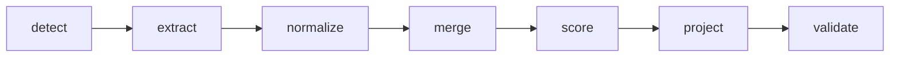

# Multi-Source Candidate Data Transformer
[](https://github.com/rahulpaul-07/multi-source-candidate-transformer/actions/workflows/ci.yml)

Turns messy, conflicting candidate data from many sources into **one clean,
canonical profile per candidate** — normalized, deduplicated, and carrying
**provenance + confidence on every value**.

Guiding rule: *wrong-but-confident is worse than honestly-empty.* Unknown values
become `null`, never invented; a fact guessed from free text is kept at low
confidence and can never override a structured one.

> The one-page technical design (PDF) submitted alongside this repo explains the
> reasoning behind every decision below.

## Pipeline



Each stage is one module under `src/candidate_transformer/`, so the design maps
1:1 to the code.

| Stage      | Module           | What it does |
|------------|------------------|--------------|
| detect     | `detect.py`      | Decide what each input is (CSV / ATS-JSON / notes / GitHub); unknown → skip. |
| extract    | `extractors/`    | Convert every source into uniform `Observation`s with canonical field names. |
| normalize  | `normalize.py`   | E.164 phones, `YYYY-MM` dates, ISO-3166 country, canonical skill names, lowercased emails. |
| merge      | `merge.py`       | Identity resolution (union-find + blocking), conflict resolution, list/object merging. |
| score      | `confidence.py`  | Per-field + overall confidence from source weight × method, corroboration, disagreement penalty. |
| project    | `projection.py`  | Render the canonical record into the config-requested shape (the configurable "twist"). |
| validate   | `validate.py`    | Validate output against the default schema or a schema derived from the config. |

The internal **canonical record** always holds the full profile with metadata;
the **projection layer** is a stateless view over it, so one engine serves the
default schema and every custom config.

## Sources covered

Two structured (**recruiter CSV**, **ATS JSON** with foreign field names) and two
unstructured (**recruiter notes** free text, **GitHub** via a cached fixture).

## Install

```bash
pip install -r requirements.txt        # phonenumbers, pycountry, jsonschema, pytest
```

## Usage

Default canonical schema:

```bash
PYTHONPATH=src python3 -m candidate_transformer \
    samples/recruiter_export.csv \
    samples/ats_export.json \
    samples/notes/robert.txt samples/notes/priya.txt \
    samples/github_cache/robsmith.github.json \
    samples/github_cache/priya-dev.github.json \
    samples/broken.json \
    -o out/default_output.json
```

Custom output (subset, renamed fields, per-field normalization, toggled metadata):

```bash
PYTHONPATH=src python3 -m candidate_transformer samples/*.csv samples/*.json \
    samples/notes/*.txt samples/github_cache/*.github.json \
    -c config/custom_output.json -o out/custom_output.json
```

### Windows (PowerShell)

```powershell
pip install -r requirements.txt
$env:PYTHONPATH = "src"
python -m pytest -q

python -m candidate_transformer samples\recruiter_export.csv samples\ats_export.json `
  samples\notes\robert.txt samples\notes\priya.txt `
  samples\github_cache\robsmith.github.json samples\github_cache\priya-dev.github.json `
  samples\broken.json -o out\default_output.json
```
GitHub: pass a fixture file (`*.github.json`) or a handle (`github:robsmith`).
Live fetching is opt-in and off by default, so runs are deterministic and offline.

Pre-generated results are committed in [`out/`](out/).

## Configurable output

The runtime config reshapes the output with **no code change**:

```json
{
  "fields": [
    { "path": "full_name", "type": "string", "required": true },
    { "path": "primary_email", "from": "emails[0]", "type": "string", "required": true },
    { "path": "phone", "from": "phones[0]", "type": "string", "normalize": "E164" },
    { "path": "skills", "from": "skills[].name", "type": "string[]", "normalize": "canonical" }
  ],
  "include_confidence": true,
  "include_provenance": false,
  "on_missing": "null"
}
```

- `from` supports dotted keys, array index (`emails[0]`) and array-map (`skills[].name`).
- `normalize`: `E164` | `canonical`.
- `on_missing`: `null` | `omit` | `error`.
- `include_confidence` / `include_provenance` toggle metadata on/off.
- Required fields may not be null; the output is validated against a schema
  derived from the config before it is returned.

## How merge & confidence work

- **Identity match keys:** primary = normalized email; fallback = normalized name
  + a second signal (phone or GitHub/LinkedIn handle). Name alone never merges.
  Transitive matches are clustered with union-find; blocking keeps it near-linear.
- **Winner (single-value fields):** source-reliability rank (ATS ≈ CSV > GitHub >
  notes) × corroboration × extraction method, with a deterministic tie-break.
- **List fields** (emails, phones, skills) are unioned + deduped; experience /
  education are matched by key (company + start / institution + degree) and merged.
- **Confidence:** `source_weight × method_factor`, agreeing sources combine as
  `1 − ∏(1 − cᵢ)`, conflicting values take a penalty; overall is an
  importance-weighted average.

## Edge cases handled

- Conflicting values for the same person → matched, winner chosen, confidence dropped.
- Malformed / empty source (e.g. `samples/broken.json`) → caught per-source, skipped, run continues.
- Required field missing under `on_missing: "error"` → fails loudly naming the field.
- A fact scraped from free text → lower confidence, can't override a structured value.
- Multiple emails / phones → union + dedupe, deterministic primary.

## Tests

```bash
PYTHONPATH=src python3 -m pytest -q
```

Covers normalization, transitive identity merge, no-false-merge, confidence
behaviour, international phones, **determinism (input-order independent)**,
custom-config projection, `on_missing` policies, and schema validation.

## Determinism

Same inputs always produce byte-identical output (sorted inputs, rule-based
merge, fixed tie-breaks, rounded confidences). Verified by a test that runs the
pipeline with reversed input order and asserts identical JSON.

## Assumptions & deliberately descoped

- Phone region defaults to **US** when a number has no country code and the
  candidate's country is unknown (the candidate's country overrides it).
- Phone validity uses `is_possible_number` (structural) rather than strict
  validity, to avoid dropping legitimate-but-unverifiable numbers.
- Year-only dates are kept as `YYYY` — we do not invent a month.
- **Descoped:** fuzzy/ML name matching (avoids wrong merges), LinkedIn/resume
  parsing, a full skill taxonomy (a curated alias map is used), and any
  database/persistence (in-memory + JSON I/O). Live GitHub is cached to a fixture.

## Project structure

```
src/candidate_transformer/   engine (one module per pipeline stage)
  extractors/                csv, ats_json, notes, github
config/custom_output.json    example runtime config
samples/                     example inputs (incl. a malformed source)
out/                         outputs produced from the samples
tests/                       unit + end-to-end tests
```
